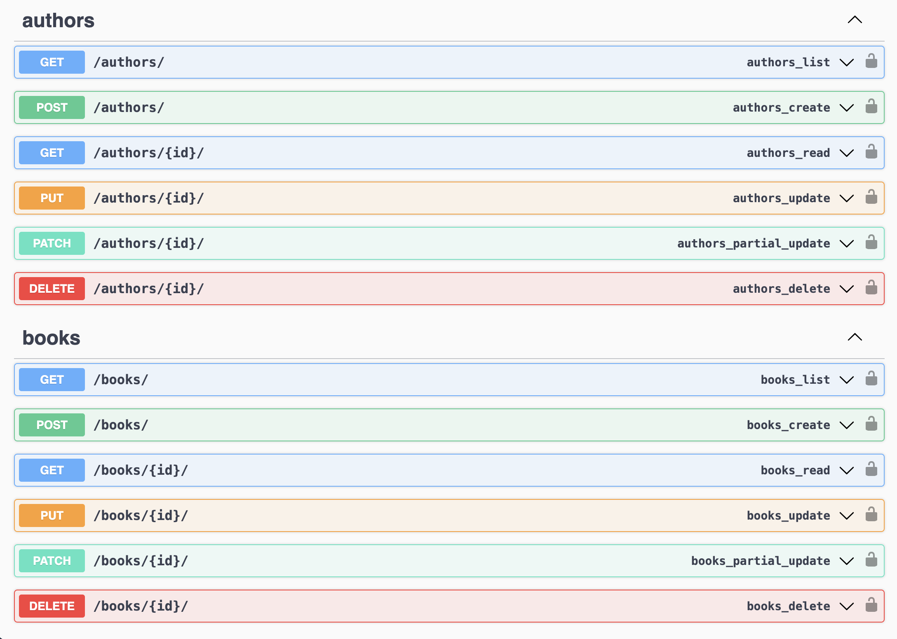
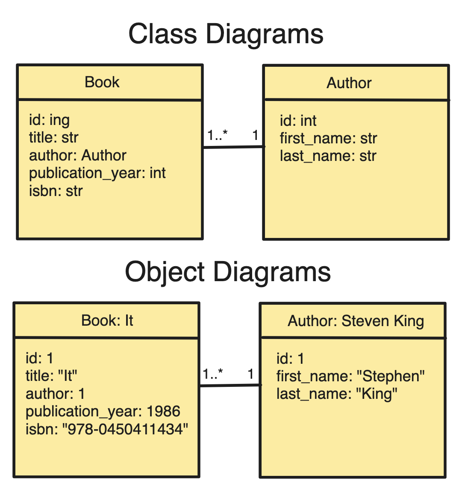

# Django Spooky Books Catalogue System

### Brief

Create a Library Catalogue System with Django that holds a list of halloween themed Books. A book and an Author have a one to many relationship. An author has many books but a book only has one author.

### MVP

- A Book should have:

  - id
  - title
  - author (one to many relationship)
  - publication year
  - ISBN which will be its id
  - image

- An Author should have:

  - id
  - first name
  - last name

- User requirements:

  - The user should be able to view a list of books and authors
  - The user should be able to view one book
  - The user should be able to create a book
  - The user should be able to update a book
  - The user should be able to delete a book
  - The user should be able to search for books by title, author or ISBN.

- Considerations

  - Error handling
  - Test Driven Development - unittest + DRF API Testing
  - Insomnia testing
  - Creating documentation with AI
  - This system should be able to be used in Full Stack environment and create Django Rest Framework API to be used by React front end.
  - Use python requests library to fetch in book data from an external API or create a seeds file with data.

<br/>

## Bugs and Learning

- Django unit testing framework creates a mock database each time the setup is run but grabbing objects by id doesn't work as the ids vary each run.
  - Solution: grab objects but another unique property or multiple properties.
- I designed the author to have a first an last name but when searching by author name I wanted the user to be able to search first or last name without having to specify.
  - solution I used the `Q` object for a more complex lookup filtering on both the first_name and last_name fields of the Author model which achieved the same thing by create a kind of OR query.

<br/><br/>

## SETUP

1. Clone this repo.

2. Install from requirements.

```sh
# Terminal

pip install -r requirements.txt
```

3. Create Postgres database and load server. Ensure you have postreSQL and psycopg2 driver installed.

```sh
# Terminal

createdb spooky_books
python3 manage.py loaddata seeds
python3 manage.py runserver
```

<br/><br/>

## API Documentation

Once the app is running you have view the [API Documentation](http://localhost:8000/api/swagger/) generated using Swagger.



<br/><br/>

<br/><br/>

## Approach

- Planning: user requirements, class and object diagrams, wire frames,
- Planned time for building and time for research on Django Api testing, django forms and Swagger.
- Integrated a postgres database.
- Made Regular commits and worked on features in branches.
- Used TDD and wrote up unit tests for models and views and API tests for api views.
- implemented Filtering of books by title, author name and isbn.
- Built a full stack Django catalogue system following RESTfull routing conventions to ensure the system was easy to understand by other developers, maintainable and scalable.
- Added DRF and build the API in a separate app to be tested and treated as a separate concern.
- Used swagger and open AI to create API documentation.

### Planning

1. Create a Brief with MVP meeting basic user requirements.

2. Created class and object diagrams.



### Project Setup

1. Setup and Activate `venv` Virtual Environment (comes included with python3)

```sh
# Terminal

# Setup venv
python3 -m venv .env

# Activate venv
source .env/bin/activate
```

2. Install Django and Create project

```sh
# Terminal

# Install Django
pip3 install django

# Create new Project
django-admin startproject spooky_books
```

3. Freeze project dependencies

```sh
# Terminal

pip3 freeze > requirements.txt
```

4. Create the projects main app `catalogue`. I will mange both Authors and Books models in the same app as these models are tightly coupled, depend heavily on each other and closely related. If the project was going to grow in scale, e.g. Author profiles or book reviews etc, It would make sense to manage these in separate apps. Only a simple restructure.

```sh
# Terminal

python3 manage.py startapp catalogue
python3 manage.py startapp information
```

Add new apps to installed apps

```py
# settings.py
INSTALLED_APPS = [
    # ...
    "catalogue",
    "information",
]
```

5. Setup `catalogue` app to have a home view function and create urls to handing routing, and register the urls with the project urls.

6. Implement postgresql Database

```sh
# Terminal

# Install psycopg2 driver
  pip3 install psycopg2
  pip3 freeze > requirements.txt

# Create database
  createdb spooky_books

# Flush Database
  pip3 manage.py flush
```

```py
# settings.py

DATABASES = {
    "default": {
        "ENGINE": "django.db.backends.postgresql_psycopg2",
        "NAME": "spooky_books",
        "USER": "<username>",
        "PASSWORD": "<password>",
        "HOST": "localhost",
        "PORT": "5432",
    }
}
```

6. Created unit tests to test the creation of my Models using djangos built in testing functionality.
   unit tests are in catalogue/test.py.

Run tests

```sh
# Terminal

python3 manage.py test
```

7. Building Models

```sh
# Terminal

python3 manage.py makemigrations
python3 manage.py migrate
python3 manage.py loaddata seeds

# Create admin user to view objects in the admin portal
python3 manage.py createsuperuser
```

9. If you want to create a full stack django app you cerate the following directories and html pages and add the templates directory to your `setting.py`:

```py
# settings.py

'DIRS': ['templates/'] # line 57
STATICFILES_DIRS = ["static"] #Add
STATIC_URL = "/static/"
```

```sh
md templates
touch templates/base.html
touch templates/index.html
md templates/books
touch templates/books/index.html
touch templates/books/show.html
touch templates/books/new.html
touch templates/books/edit.html

md static/css
md static/images
touch static/css/style.css
```

10. Integrated the search functionality in to the view.py to allow the user to search by title, author and isbn.

11. Created unit tests to test the views.py functions. Unit tests are in catalogue/test.py.

Run tests

```sh
# Terminal

python3 manage.py test
```

12. Created a separate app for my Django Rest Framework API. This separates the concerns for now of the integrated views for internal Django frontend and allows for routing to `api/books` or `api/authors`.

```sh
# Terminal

pip3 install djangorestframework
pip3 freeze > requirements.txt
python3 manage.py startapp api

# Added "rest_framework" to INSTALLED APPS
# Added "api" to INSTALLED APPS

python3 manage.py migrate
python3 manage.py makemigrations
```

13. Created the views using DRF integrated generics library. One url will no idea can handle the List and Create route. One url with and id attached can handle the Show One, Update and Destroy routes.

14. Create serializers for Books and Authors which handles converting requests and responses to JSON.

15. Configured the API to handle the filtering for the book search functionality by title, author and ISBN. I used the django fileter library as it creates complex filtering in a simple way.

```sh
# Terminal
pip install django-filter
pip3 freeze > requirements.txt
```

```py
# Settings
INSTALLED_APPS = [
    'django_filters',
]

REST_FRAMEWORK = {
    'DEFAULT_FILTER_BACKENDS': ['django_filters.rest_framework.DjangoFilterBackend'],
}
```

Create a customer filter for title, author name and ISBN.

```py
# api/filters.py
import django_filters
from catalogue.models import Book


class BookFilter(django_filters.FilterSet):
    class Meta:
        model = Book
        fields = {
            "title": ["icontains"],
            "author__first_name": ["icontains"],
            "author__last_name": ["icontains"],
            "ISBN": ["icontains"],
        }

# api/views.py
class BookList(generics.ListCreateAPIView):
    queryset = Book.objects.all()
    serializer_class = BookSerializer
    filter_backends = [DjangoFilterBackend]
    filterset_class = BookFilter  # This custom filter class is in filter.py
```

Now I can filter a list of books using query parameters of title, authors name an isbn.
`http://localhost:8000/api/books/?title=specific+title&author\_\_first_name=author+name`

I wanted the user to be able search by either authors first or last name without having to specify so I made use of the `Q` object from django models allowing a way to mae an OR to amke a more complex query.

```py
# filters.py
import django_filters
from catalogue.models import Book
from django.db.models import Q


class BookFilter(django_filters.FilterSet):
    # Custom filters
    title = django_filters.CharFilter(field_name="title", lookup_expr="icontains")
    ISBN = django_filters.CharFilter(field_name="ISBN", lookup_expr="icontains")
    author_name = django_filters.CharFilter(method="filter_by_author_full_name")

    class Meta:
        model = Book
        fields = []

    # This function will perform the 'author' filtering.
    def filter_by_author_full_name(self, queryset, name, value):

        # Splitting by spaces, assuming that first and last names are separated by spaces
        names = value.split()

        # We create queries for each word, assuming it could be either first or last name.
        queries = [
            Q(author__first_name__icontains=name) | Q(author__last_name__icontains=name)
            for name in names
        ]

        # Start with a base query which includes the entire queryset
        query = Q(pk__in=queryset)

        # 'AND' the name queries together
        for q in queries:
            query &= q

        return queryset.filter(query)

```

16. Tested all the API route on insomnia.

17. Created Django API testing for all routes and API filtering in the api app.

18. Handled CORS in Django backend.

```sh
# Terminal
pip install django-cors-headers

```

```py
# setting.py

CORS_ALLOWED_ORIGINS = ["http://localhost:3000"]

INSTALLED_APPS = ['corsheaders']

MIDDLEWARE = [
    'corsheaders.middleware.CorsMiddleware',
    'django.middleware.common.CommonMiddleware',
]
```

19. Created documentation for the API using Swagger.

Swagger Installs

```sh
# Terminal

  pip3 install django-rest-swagger
  pip install drf-yasg
  pip3 freeze > requirements.txt
```

Swagger update to settings.py and urls.py

```py
# settings.py
INSTALLED_APPS = [
    "django_filters",
    "drf_yasg",
]

# api/urls.py
from rest_framework import permissions
from drf_yasg.views import get_schema_view
from rest_framework_swagger.views import get_swagger_view
from drf_yasg import openapi

schema_view = get_schema_view(
    openapi.Info(
        title="Spooky Books",
        default_version="v1",
        description="Spooky Books Catalogue.  Brows your favorite spooky books and get spooked",
        terms_of_service="https://github.com/sjohns2020/spooky_books",
        contact=openapi.Contact(email="seanjo86@gmail.com"),
        license=openapi.License(name="BSD License"),
    ),
    public=True,
    permission_classes=(permissions.AllowAny,),
)

urlpatterns = [
    # API ROUTES
    re_path(
        r"^swagger(?P<format>\.json|\.yaml)$",
        schema_view.without_ui(cache_timeout=0),
        name="schema-json",
    ),
    path(
        "swagger/",
        schema_view.with_ui("swagger", cache_timeout=0),
        name="schema-swagger-ui",
    ),
    path("redoc/", schema_view.with_ui("redoc", cache_timeout=0), name="schema-redoc"),
]
```

See Finished Documentation [here](http://localhost:8000/swagger/)
see [Tutorial](https://episyche.com/blog/how-to-create-django-api-documentation-using-swagger)
